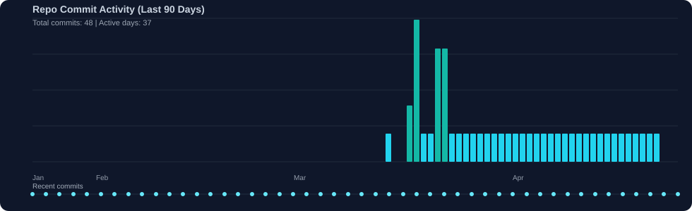

# Vertical Rotary Parking System

Android app for monitoring and controlling  vertical rotary parking system.

## Personal Workflow
```bash
git checkout main
git pull
git checkout -b <branch-name>
./gradlew :app:assembleDebug :app:lintDebug
git add .
git commit -m "<message>"
git push -u origin <branch-name>
```

## Repository Activity Graph


Auto-generated from repository commit history.
